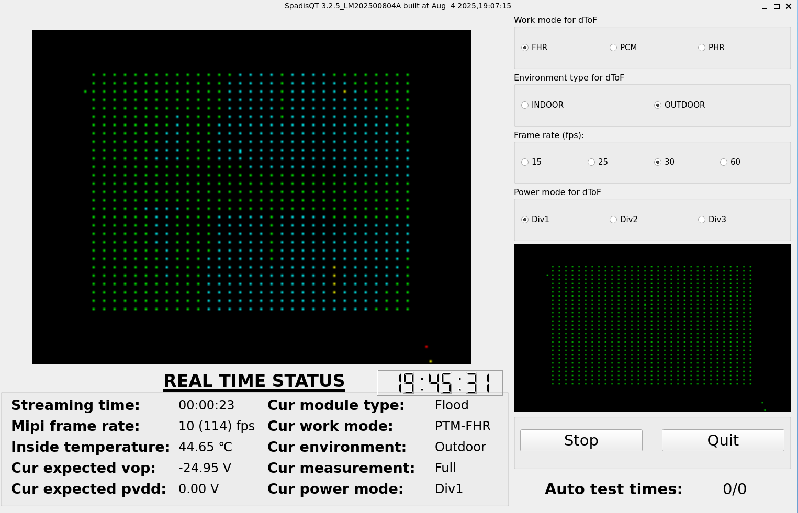

## **SpadisQT App for ADAPS ADS6401 dToF Sensor**
([Chinese version](README_zh_CN.md))

This is a demo application for the ADS6401 dToF sensor from [ADAPS Photonics](https://adapsphotonics.com/), named 'SpadisQT', designed to run on embedded Linux systems.

Using the V4L2 framework, the raw MIPI data from our Swift dToF sensor is captured, processed by our proprietary algorithm library, 
and converted into depth or grayscale data. The depth information is then visualized in RGB colors for enhanced interpretation.

It has been tested on RK3568 with Linux 5.10 kernel.

The application can be built with QT 5.x for Linux. (Note: Since the app uses V4L2 APIs, it cannot run on Windows.)

Before building and running SpadisQT, ensure your development board supports QT.  
Please study this requirement yourself, as we cannot answer such basic questions.

There are two types of dToF modules based on the ADS6401 chip:  
- **SPOT module**  
- **FLOOD module**  

The Linux kernel driver (`ads6401`) reports the module type when the `ADAPS_GET_DTOF_MODULE_STATIC_DATA` ioctl command is executed.



### **Deployment Steps**  
Follow these steps to deploy SpadisQT to your development board:

#### **Step 1: Create Required Directories**  
Run the following commands:  
```bash
mkdir -p /vendor/lib64
mkdir -p /vendor/etc/camera
mkdir -p /data/vendor/camera
```

#### **Step 2A: Copy Files via SSH**
If your board supports SSH, use these commands (replace your real build path and IP address):
```
scp /your/build/path/libadaps_swift_decode.so root@[your_board_ip]:/vendor/lib64/
scp /your/build/path/libAdapsSender.so root@[your_board_ip]:/vendor/lib64/
scp /your/build/path/adapsdepthsettings.xml root@[your_board_ip]:/vendor/etc/camera/
scp /your/build/path/SpadisQT root@[your_board_ip]:/usr/bin/
scp /your/build/path/SpadisQT_console root@[your_board_ip]:/usr/bin/
```

#### **Step 2B: Copy Files via ADB**
If your board supports ADB, use these commands (replace your real build path):
```
adb push /your/build/path/libadaps_swift_decode.so /vendor/lib64/
adb push /your/build/path/libAdapsSender.so /vendor/lib64/
adb push /your/build/path/adapsdepthsettings.xml /vendor/etc/camera/
adb push /your/build/path/SpadisQT /usr/bin/
adb push /your/build/path/SpadisQT_console /usr/bin/
```

#### **Step 3: Set Executable Permissions**

```
chmod +x /usr/bin/SpadisQT
chmod +x /usr/bin/SpadisQT_console
```

For questions, contact us: [ADAPS Photonics](https://adapsphotonics.com/).

### **License**
SpadisQT is licensed under:

[GNU LGPLv3](https://opensource.org/licenses/LGPL-3.0)

[QT LGPL](https://doc.qt.io/archives/qt-5.15/lgpl.html)

